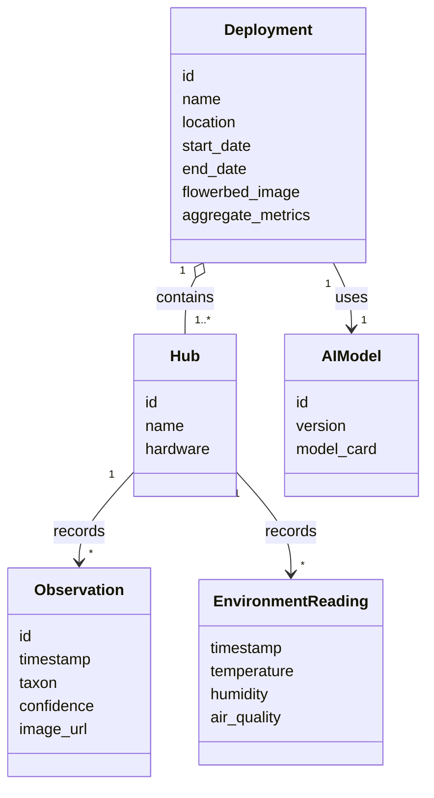
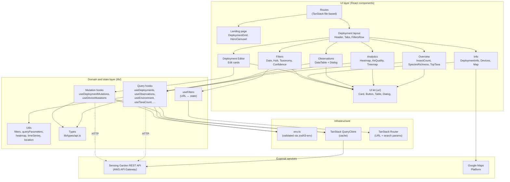
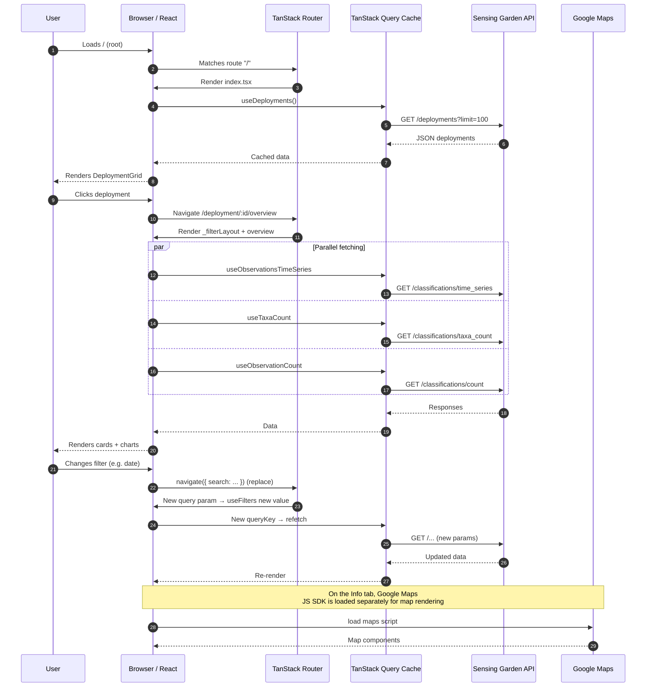
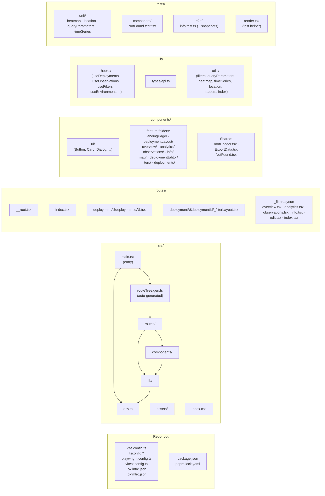
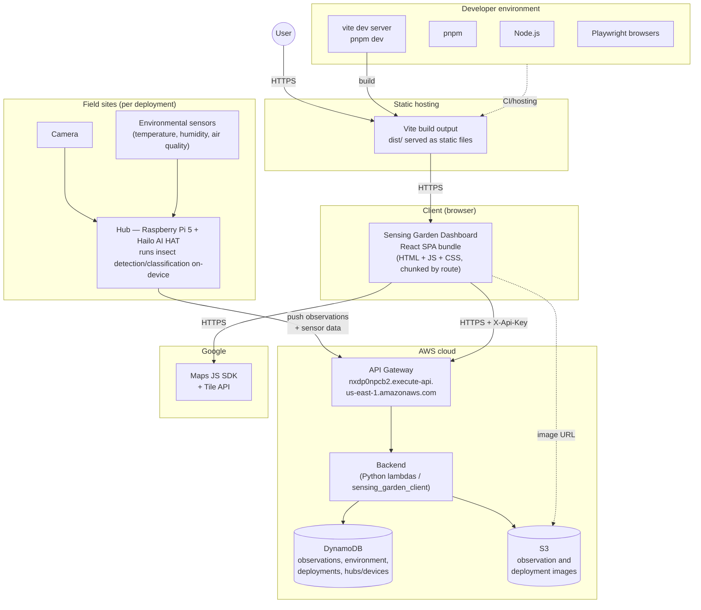
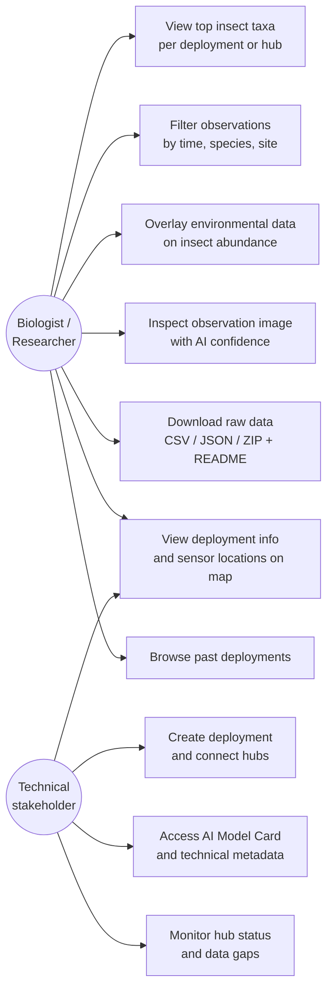
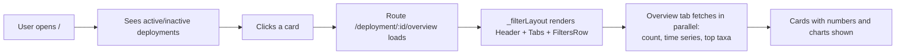
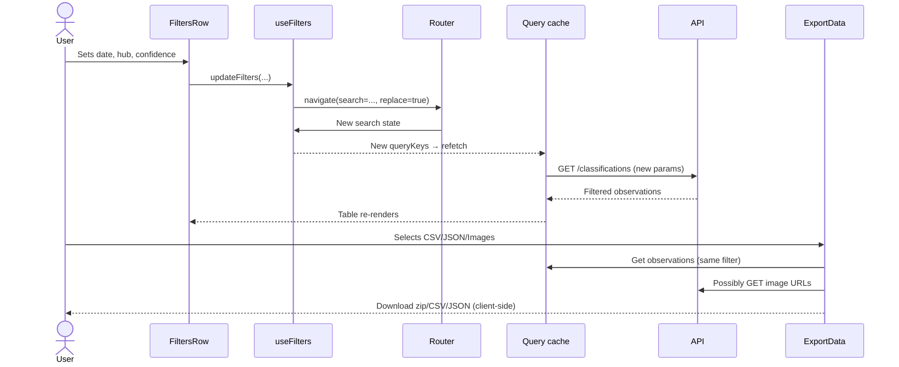
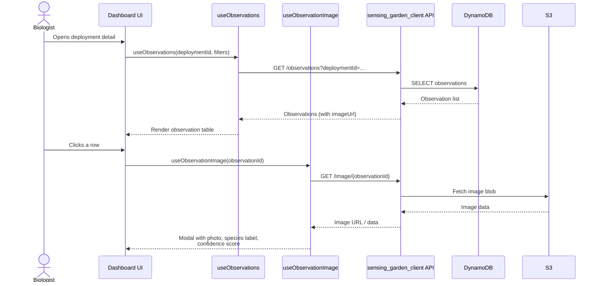
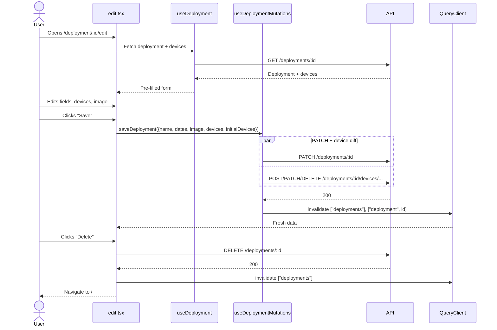

# Architecture Documentation — Sensing Garden Dashboard

The architecture is described using Kruchten's **4+1 View Model**. Each view answers a different question:

| View                  | Question                                       | Audience              |
| --------------------- | ---------------------------------------------- | --------------------- |
| Logical               | What does the system consist of, functionally? | End users, designers  |
| Process               | How does the system behave at runtime?         | Integrators           |
| Development           | How is the code organized?                     | Developers            |
| Physical (Deployment) | Where does it run?                             | Operations / sysadmin |
| Scenarios (+1)        | How does it work in practice?                  | Everyone              |

The dashboard is a React 19 SPA (Vite + TanStack Router/Query) that visualizes data from the Sensing Garden backend. All state lives either in the URL (filters via query params) or in the TanStack Query cache (server data). There is no separate backend in this repo — the app talks directly to the REST API on AWS API Gateway.

## Domain model

The system revolves around four core concepts:

- **Deployment** — a collection of one or more hubs grouped together at a physical location (e.g. a rooftop or park). Each deployment has a lifetime (start/end date), a location, and an optional flowerbed image. Deployments also carry pre-computed aggregate metrics (top taxa, counts) to avoid re-computing them on every dashboard load.
- **Hub** (also called _device_ in the API/code) — a Raspberry Pi 5 + Hailo AI HAT edge unit with attached camera and environmental sensors. A hub belongs to exactly one active deployment at a time and is the source of all observations and environmental readings for that site.
- **Observation** — a single insect detection produced by a hub, stored with a taxonomic classification, an AI confidence score, a timestamp, and a link to the original image in S3.
- **AI model** — each deployment is associated with the model version its hubs ran during that deployment window. The model's metadata ("Model Card") is exposed in the dashboard so users can judge the provenance of the predictions.

---

## 1. Logical View

Shows the main components, their responsibilities, and dependency directions. The layering mirrors the folder structure under `src/`.

### Key abstractions

- **Routes** — one file per URL under `src/routes/`. `_filterLayout` is a "pathless layout route" that shares Header/Tabs/FiltersRow across all sub-pages for a single deployment.
- **Query hooks** — thin wrappers around `fetch` + `useQuery`. One hook per endpoint. Response types are centrally defined in `lib/types/api.ts`.
- **`useFilters`** — reads/writes filter state to URL search parameters, validated with Zod (`filtersSchema`). Enables shareable links and browser "back" support.
- **UI kit** (`components/ui/`) — shadcn-inspired Base UI components. Reusable building blocks with no domain knowledge.

---

## 2. Process View

Shows runtime behavior: startup, data flow, and concurrent fetches. The app has only one process (a browser tab), but multiple async operations are coordinated by TanStack Query.

### Characteristics

- **No global state manager** — the cache is the source of truth for server data; the URL is the source of truth for filter state.
- **Cache invalidation** happens after mutations (`queryClient.invalidateQueries(["deployments"])`, etc.).
- **Preload on intent** — router has `defaultPreload: "intent"`, so hovering a link pre-fetches route data.
- **Parallel fetch** — independent hooks in the same render trigger parallel requests; React Query dedupes them.
- **Export** (`ExportData`) performs an ad-hoc fetch for ZIP/CSV/JSON and uses `JSZip` + `Blob` + object URLs for client-side download.

---

## 3. Development View

Source code organization as seen by the developer. The alias `@/` points to `src/`.

### Conventions (from `CONTRIBUTING.md`)

- React components use PascalCase and live in `src/components/<feature>/`.
- UI primitives from shadcn (Base UI variant) go in `components/ui/`.
- Data fetching uses TanStack Query hooks in `lib/hooks/`.
- No inline `export` — a single `export { ... }` at the bottom of the file (except `Route` in routes).
- Tailwind for styling, with custom theme tokens (`text-muted-foreground`, not `text-zinc-400`).
- Oxlint + Oxfmt run via `simple-git-hooks` as a pre-commit hook.

### Test pyramid

- Unit (`vitest`): pure utility functions.
- Component (`vitest` + `vitest-browser-react`): top-level components.
- E2E (`playwright`): route/page level, including visual snapshots.

---

## 4. Physical View (Deployment)

Where does the application run in production?

The dashboard is only one of three physical tiers in the overall Flik system: the **field sites** (edge devices), the **AWS cloud** (API + storage), and the **end-user dashboard** running in a browser. This repo owns the dashboard tier, but its design is shaped by what the other two tiers produce and accept.

### Runtime assumptions

- The SPA bundle only needs static hosting (CDN / object storage) — no server-side rendering.
- `.env` must contain `VITE_API_BASE_URL`, `VITE_API_KEY`, and optionally `VITE_GOOGLE_MAPS_API_KEY`. These are baked into the bundle by `vite build` and are therefore public. The API key should consequently be restricted on the server side.
- Authentication: every call attaches the `X-Api-Key` header (see `lib/utils/headers.ts`).

---

## 5. Scenarios (+1)

The dashboard has two primary stakeholder groups whose use cases drive the scenarios below:

- **Biologist / Researcher** — inspects ecological patterns, compares trends across sites and time, and validates individual detections against the original images.
- **Technical stakeholder** — manages deployments and hubs, keeps an eye on data quality and hub status, and needs visibility into which AI model produced which data.

The four scenarios below tie the other views together and show how these use cases are realized end-to-end.

### Scenario A — View data for a deployment

### Scenario B — Filter observations and export

### Scenario C — Biologist inspects an observation image

### Scenario D — Edit deployment (CRUD)

---

## Appendix — Key technologies

| Area             | Choice                                                                              |
| ---------------- | ----------------------------------------------------------------------------------- |
| Language/runtime | TypeScript, React 19, Node (dev), pnpm                                              |
| Bundler/dev      | Vite 8, `@vitejs/plugin-react`, `@tailwindcss/vite`                                 |
| Routing          | `@tanstack/react-router` (file-based) + `@tanstack/zod-adapter`                     |
| Data/cache       | `@tanstack/react-query`                                                             |
| Table            | `@tanstack/react-table`                                                             |
| UI               | Base UI (`@base-ui/react`), Tailwind v4, `class-variance-authority`, `lucide-react` |
| Maps             | `@vis.gl/react-google-maps`                                                         |
| Charts           | `recharts`                                                                          |
| Validation       | `zod`, `@t3-oss/env-core`                                                           |
| Testing          | Vitest, `vitest-browser-react`, Playwright                                          |
| Lint/fmt         | Oxlint, Oxfmt, `simple-git-hooks`, `lint-staged`                                    |
